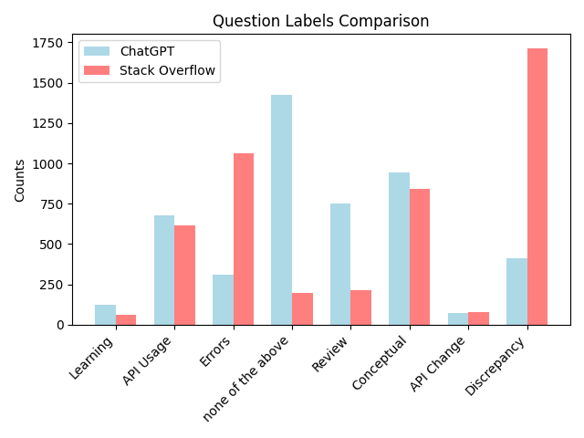

# MSR-2024
MSR 2024 Mining Challenge

This artifact is by Ali Rafiei, for the paper "From Forums to AI: A Comparative Study of Developer Queries on ChatGPT and Stack Overflow"

## External Data
* Stack Overflow Data Dump: https://archive.org/details/stackexchange
* DevGPT: https://github.com/NAIST-SE/DevGPT

## Download Additional Files
Please download the additional files for this project from the following Google Drive link: https://drive.google.com/drive/folders/1gKOIpz0ufwyCtU1rUXi6e7DgvLHu2G42?usp=sharing

### Files
* **stackoverflow.com-Posts.7z:** This is a mandatory file needed to extract the Stack Overflow data, place file within the `analysis` folder.
* **so.txt:** This is a mandatory file that is the results of running `scrapeSO.py` (see instructions below), needed to run `SOrefine.py`, place file within the `analysis` folder
* **filtered_data.json:** This is a mandatory file that is the results of running `refineDevGPT.py`, needed to run `refineDevGPTDate.py`, place file within the `analysis` folder
* **filtered_out_data.json:** This is an optional file that is the results of running `refineDevGPT.py`, place file within the `analysis` folder

## Content
The file structure of the artifact is as follow:
* **analysis:**
    * **graphs:** folder with all collected/generated graphs
    * **combined_data_final.json:** final json file with complete labelled data for creating graphs
    * **combined_data.json:** json file produced by label_data.py and label_data_errorgpt.py, remainder of un-labelled questions are manually labelled here
    * **count_tokens.py:** check how many tokens will be needed to label all the data using gpt-3.5-turbo-1106
    * **filtered_data.json:** filtered data from refineDevGPT.py
    * **filtered_out_data.json:** filtered out data from refineDevGPT.py (repeating data and non-english data)
    * **graphs.py:** takes combined_data_final.json and creates double bar graphs and word clouds to represent collected labels
    * **label_data_errorgpt.py:** finds all labels created by label_data.py that don't use pre-existing labels and adds "ErrorGPT" to combined_data.json 
    * **label_data.py:** combines refined_devgpt.json and refined_so.json to generate labels using gpt-3.5-turbo-1106 to create combined_data.json
    * **man_analy.py:** create statistically significant randomly sampled samples into json files named man_analy1.json and man_analy2.json
    * **man_analy1.json:** used to assess context labels before adding them into the prompt for gpt labelling
    * **man_analy2.json:** used to assess how accurate the gpt labelling was via manual analysis
    * **prompt.txt:** prompt used for gpt labelling
    * **refined_devgpt.json:** refined devgpt data (removed non-aligning dates), used for final labelling of data
    * **refined_so.json:** refined Stack Overflow data (randomly sampled data from so.txt to reduce size of data), used for final labelling of data
    * **refineDevGPT.py:** removes repeating and non-english data from all of the devgpt snapshots, creates filtered_data.json and filtered_out_data.json
    * **refineDevGPTDate.py:** removes non-aligned dates from filtered_data.json, creates refined_devgpt.json
    * **requirements.txt:** dependencies needed to run all python programs
    * **scrapeSO.py:** helps mine all data needed from stackoverflow.com-Posts.7z, must use specific terminal command for proper use
    * **so.txt:** mined data from scrapeSO.py
    * **SOrefine.py:** randomly samples from so.txt to have the same number of prompts as the DevGPT data, creates refined_so.json
    * **stackoverflow.com-Posts.7z:** zip file for all Stack Overflow data (~20GB)
* **DevGPT:** folder with all of the DevGPT data that will be used for analysis

## Python Programs and Analysis
All files in terms of python programs and analysis scripts can be found in the "analysis" folder found in the same directory as the README.md. For all future instructions, make sure your terminal window is inside the "analysis" folder.


## Step-by-Step Reproduction of Results Process

Before you start, make sure you have installed all the dependencies by running one of the following commands:

```
pip install -r requirements.txt
```
or

```
pip3 install -r requirements.txt
```

You also need to be able to extract 7z files. If you don’t have the p7zip tool, you can install it with this command (MacOS users must brew install):
```
brew install p7zip
```

Then, follow these steps to complete the reproduction process:

1. Extract all of the Stack Overflow data from the 7z file using the following terminal command (this can take 4-6 hours):
```
7z e -so stackoverflow.com-Posts.7z | python3 scrape.py > so.txt
```


2. Run `refineDevGPT.py` to create `filtered_data.json` and `filtered_out_data.json`. This program will automatically obtain the DevGPT data from the folder itself.

3. Once `so.txt` and `filtered_data.json` are obtained, run `refineDevGPTDate.py` and `SOrefine.py` in no particular order.

4. Once `refined_devgpt.json` and `refined_so.json` have been created, specify in line 7 of `man_analy.py` with “context_labels” to obtain the statistically significant sample size used to determine context labels via manual analysis (this is `man_analy1.json`).

5. Run `count_tokens.py` to determine how many tokens it will take to run `label_data.py`, this program will also tell you the minimum amount of money (USD) to load into your openai account. Add 1-3 dollars over this number just in case.

6. Make sure to create your openai API key and place it into line `19` of `label_data.py` before running it. The program will automatically save any progress in terms of labeling data should the program exit during runtime, in that case, un-comment lines `175-184` and comment the line sections `157-173` and then re-run the program. Labeling the data will take 10-15 hours to complete, resulting in `combined_data.json`. (Due to the probabalistic nature of using gpt-3.5-turbo-1106 to label questions, results may vary but final results will still be similar)

7. Once `combined_data.json` is obtained, run `label_data_errorgpt.py` to find all questions that were either not given labels or were given labels that were not from the pre-defined list of labels. This program will only add “ErrorGPT”: “something went wrong” to `combined_data.json`.

8. A manual labeling process of `combined_data.json` will be done to complete some of the questions that the GPT labeling program wasn’t able to do. In my case, 126 questions needed to be manually labeled out of a total of 9376 questions.

9. After the manual labeling which is now stored in `combined_data_final.json`, run `man_analy.py` again but change line 7 to “gpt_labels” to get `man_analy2.json` which is the statistically significant random sample in determining the accuracy of the final collection of labels. My results were the following:

    - Incorrect question label lines: 112, 424, 835, 862, 916, 1174, 1192, 1200
      * 88/96 x 100 = 91.6667 % accurate
    - Incorrect context label lines: 113, 266, 308, 401, 446, 599, 695, 797, 823, 863, 884, 953, 1013, 1093, 1115
      * 153/168 x 100 = 91.0714 % accurate

10. Finally, run `graphs.py` to create double bar graphs comparing question and context labels between ChatGPT and Stack Overflow questions, and word clouds based on the keyword labels for ChatGPT and Stack Overflow.

## Results
### Label Comparisons Between ChatGPT and Stack Overflow Questions



### Keyword Word Cloud from ChatGPT Questions

### Keyword Word Cloud from Stack Overflow Questions

